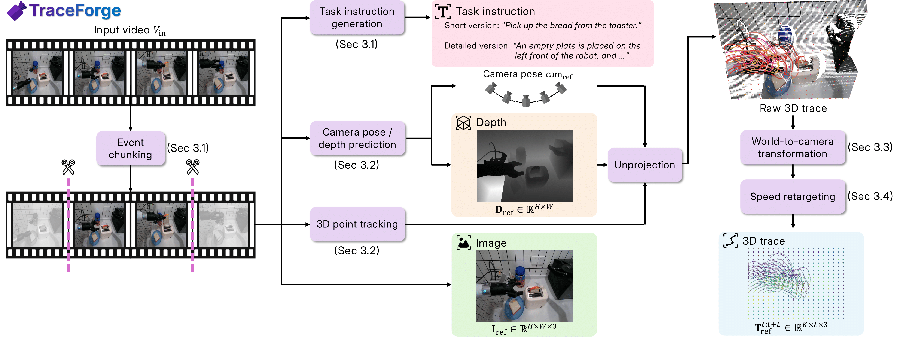
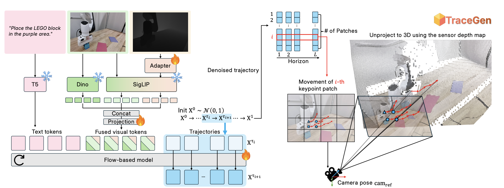

#  TraceGen: World Modeling in 3D Trace-Space Enables Learning from Cross-Embodiment Videos

Official repository for the project **TraceGen: World Modeling in 3D Trace-Space Enables Learning from Cross-Embodiment Videos**.

**Project Website**: [tracegen.github.io](https://tracegen.github.io/)  
**arXiv**: [2511.21690](https://arxiv.org/abs/2511.21690)


##  TraceForge

For the data generation pipeline **TraceForge** that prepares cross-embodiment 3D trace dataset for TraceGen training, please refer to  
**[TraceForge GitHub Repository](https://github.com/Yoonkyo/TraceForge)**.

**TraceForge** is a scalable data pipeline that transforms heterogeneous human and robot videos into consistent 3D traces.

- **Camera motion compensation**: Estimating camera pose and depth, and applying world-to-camera alignment
- **Speed retargeting**: Normalizing motion speeds across different embodiments
- **3D point tracking**: Using predicted camera poses and depth to reconstruct scene-level 3D trajectories for both robot and object motion


## Installation for  TraceGen

We provide two ways to install TraceGen conda environment. Both tested on PyTorch 2.4.1 with CUDA 12.4.

### Option 1: Using Conda Environment (Recommended)

1. Create and install environment from `environment.yml`:
```bash
conda env create -f environment.yml
conda activate trace_gen
```


### Option 2: Manual Installation

1. Create a conda environment:
```bash
conda create -n trace_gen python=3.10
conda activate trace_gen
```

2. Install PyTorch (We tested on 2.4.1):
```bash
conda install pytorch==2.4.1 torchvision==0.19.1 torchaudio==2.4.1 pytorch-cuda=12.4 -c pytorch -c nvidia
```

3. Install all dependencies:
```bash
pip install -r requirements.txt
```

## Quick Start

1. **Setup your local configuration**: Create a local config file with your dataset paths:

```bash
cp cfg/train.local.yaml.example cfg/train.local.yaml
# Edit cfg/train.local.yaml with your dataset directories and checkpoint paths
```

2. **Start training**: See the [Training](#training) section below for detailed examples.

## Prepare Dataset for  TraceGen

Datasets prepared through  **TraceForge** should be organized as follows:
```
data/
├── episode_01/
│   ├── images/
│   │   ├── episode_01_0.png
│   │   ├── episode_01_5.png
│   │   └── ...
│   ├── samples/
│   │   ├── episode_01_0.npz  # Contains 'keypoints' array [N, 2]
│   │   ├── episode_01_5.npz
│   │   └── ...
│   ├── depth/ # (optional)
│   │   ├── episode_01_0_raw.npz  # Contains 'keypoints' array [N, 2]
│   │   ├── episode_01_5_raw.npz
│   │   └── ...
│   └── task_descriptions.json
├── episode_02/
└── ...
```


## Training  TraceGen

### Important Configuration Guidelines

**Training with Small Datasets**

When training with small datasets, frequent visualization and checkpoint saving can be inefficient. We recommend the following configuration adjustments:

```yaml
save_every: 20
num_log_steps_per_epoch: 0  # Disable intra-epoch logging
eval_every: 20
visualize_every: 20
val_split: 0.1  # Or larger to avoid zero validation samples
```

**Training with Large Datasets**

For large datasets, to ensure adequate logging frequency and avoid sparse checkpoints:

```yaml
save_every: 1
num_log_steps_per_epoch: 10  # Or higher for more frequent intra-epoch logging
eval_every: 1
visualize_every: 1
val_split: 0.01 # Small enough number to avoid validation takes too much time
```

### Option 1: Single GPU Training from Scratch

```bash
export CUDA_VISIBLE_DEVICES=0
python train.py \
  --config cfg/train.yaml \
  --override \
  train.batch_size=6 \
  train.lr_decoder=1.5e-4 \
  model.decoder.num_layers=12 \
  model.decoder.num_attention_heads=16 \
  model.decoder.latent_dim=768 \
  data.num_workers=4 \
  hardware.mixed_precision=true \
  logging.use_wandb=true \
  logging.log_every=2000
```

### Option 2: Multi-GPU Training from Scratch

```bash
export CUDA_VISIBLE_DEVICES=0,1,2,3
torchrun --standalone --nproc_per_node=4 \
  train.py \
  --config cfg/train.yaml \
  --override \
  train.batch_size=8 \
  train.lr_decoder=1.5e-4 \
  model.decoder.num_layers=6 \
  model.decoder.num_attention_heads=12 \
  model.decoder.latent_dim=768 \
  data.num_workers=4 \
  hardware.mixed_precision=true \
  logging.use_wandb=true \
  logging.log_every=2000
```

### Option 3: Fine-tune TraceGen with Multi-GPU

```bash
export CUDA_VISIBLE_DEVICES=0,1,2,3
torchrun --standalone --nproc_per_node=4 \
  train.py \
  --config cfg/train.yaml \
  --override \
  train.batch_size=8 \
  train.lr_decoder=1.5e-4 \
  model.decoder.num_layers=6 \
  model.decoder.num_attention_heads=12 \
  model.decoder.latent_dim=768 \
  data.num_workers=4 \
  hardware.mixed_precision=true \
  logging.use_wandb=true \
  logging.log_every=2000 \
  --resume {path_to_pretrained_checkpoint}
```

> **Note**: Replace `{path_to_pretrained_checkpoint}` with the path to your downloaded TraceGen checkpoint.


### Monitoring Training

If you enable Weights & Biases logging (`logging.use_wandb=true`), you can monitor:
- Training and validation losses
- Generated trajectory visualizations
- Predicted trajectory MSE

## Testing

> 🚧 **Note**: Detailed testing documentation will be released soon.

To evaluate a trained model on a test set:

```bash
python test_example.py \
  --config cfg/eval.yaml \
  --resume /path/to/checkpoint.pth \
  --test /path/to/test/dataset \
  --output /path/to/output/directory
```


## Repository Structure

High-level overview of the repository structure:

```
Trace_gen/
├── cfg/                          # Configuration files
├── dataio/                       # Data loading and preprocessing
├── models/                       # Model architectures
├── losses/                       # Loss functions
├── trainer/                      # Training loop implementation
├── utils/                        # Utility functions
├── train.py                      # Main training script
├── test_example.py               # Example testing script
├── test_helpers.py               # Testing utilities
├── environment.yml               # Conda environment file
├── requirements.txt              # Python dependencies
└── README.md                     # This file
```


## Roadmap

- [x] Release TraceGen training code
- [x] Release TraceForge pipeline code
- [ ] Release TraceGen pretrained checkpoints & test code documentation
- [ ] Release Dataset & Benchmark

## 📖 Citation

If you find this work useful, please consider citing our paper:

```bibtex
@article{lee2025tracegen,
  title={TraceGen: World Modeling in 3D Trace Space Enables Learning from Cross-Embodiment Videos},
  author={Lee, Seungjae and Jung, Yoonkyo and Chun, Inkook and Lee, Yao-Chih and Cai, Zikui and Huang, Hongjia and Talreja, Aayush and Dao, Tan Dat and Liang, Yongyuan and Huang, Jia-Bin and Huang, Furong},
  journal={arXiv preprint arXiv:2511.21690},
  year={2025}
}
```

## Acknowledgments

Our code modifies and builds upon:
- [CogVideoX](https://github.com/huggingface/diffusers) from HuggingFace Diffusers for the 3D trace generation model.
- [Prismatic VLMs](https://github.com/TRI-ML/prismatic-vlms) for insights on multimodal encoder design
