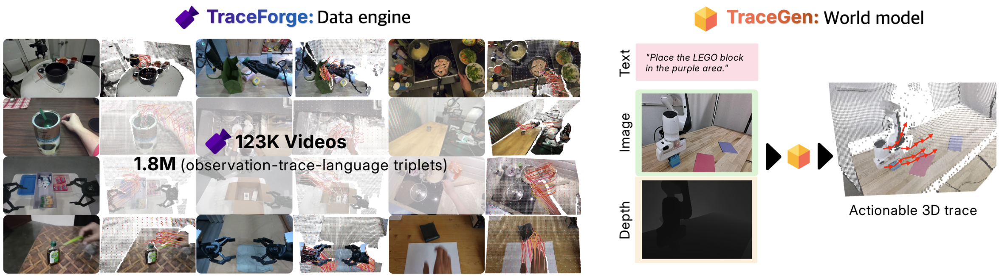

#  TraceGen

Official repository for the project **TraceGen: World Modeling in 3D Trace-Space Enables Learning from Cross-Embodiment Videos**.

🚧 **This repository is under internal review.**

## 📋 Release Schedule

- **Code Release (TraceGen & TraceForge)**: Dec 20, 2025 (tentative)
- **Dataset & Benchmark Release**: Dec 30, 2025 (tentative)


**Project Website**: [tracegen.github.io](https://tracegen.github.io/)  
**arXiv**: [2511.21690](https://arxiv.org/abs/2511.21690)




##  TraceForge

**TraceForge** is a scalable data pipeline that transforms heterogeneous human and robot videos into consistent 3D traces.

- **Camera motion compensation**: Estimating camera pose and depth, and applying world-to-camera alignment
- **Speed retargeting**: Normalizing motion speeds across different embodiments
- **3D point tracking**: Using predicted camera poses and depth to reconstruct scene-level 3D trajectories for both robot and object motion


**Code Release**: Dec 15, 2025 (tentative)


##  TraceGen

**TraceGen** is a world model that predicts future motion in 3D trace-space rather than pixel space, enabling learning from cross-embodiment, cross-environment, and cross-task videos.

**Code Release**: Dec 15, 2025 (tentative)


## 📊 Benchmark

Datasets (only those legally permitted for redistribution) and benchmarks for evaluation and comparison.

**Dataset & Benchmark Release**: Dec 30, 2025 (tentative)


## 📖 Citation

```bibtex
@article{lee2025tracegen,
  title={TraceGen: World Modeling in 3D Trace Space Enables Learning from Cross-Embodiment Videos},
  author={Lee, Seungjae and Jung, Yoonkyo and Chun, Inkook and Lee, Yao-Chih and Cai, Zikui and Huang, Hongjia and Talreja, Aayush and Dao, Tan Dat and Liang, Yongyuan and Huang, Jia-Bin and Huang, Furong},
  journal={arXiv preprint arXiv:2511.21690},
  year={2025}
}
```

